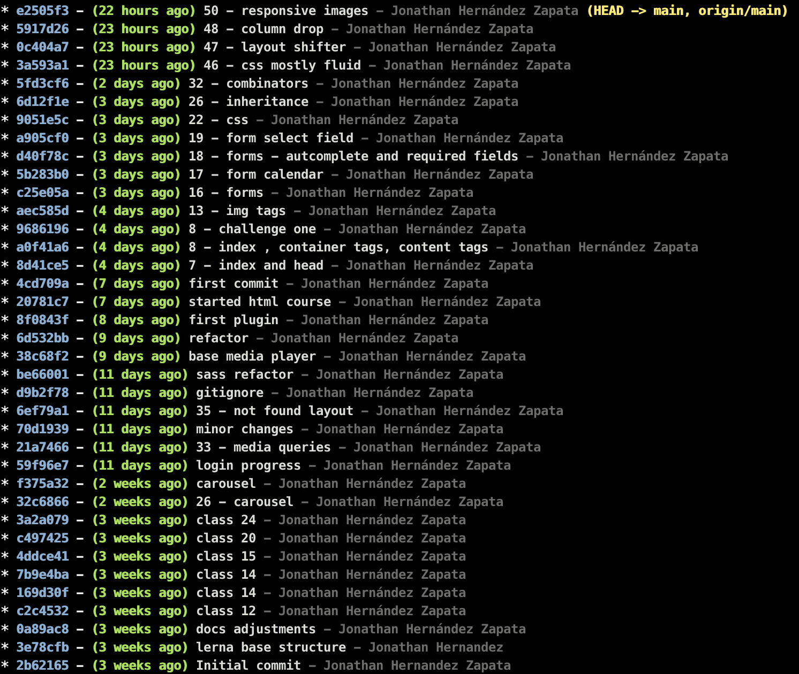

[](https://lerna.js.org/)
[](https://github.com/jhz-dev/platzi/blob/main/LICENSE)


# Mono repo for Platzi courses

# Notes:
git log tree

* Run this in your terminal
```
git config --global alias.superlog "log --graph --abbrev-commit --decorate --date=relative --format=format:'%C(bold blue)%h%C(reset) - %C(bold green)(%ar)%C(reset) %C(white)%s%C(reset) %C(dim white)- %an%C(reset)%C(bold yellow)%d%C(reset)' --all"
```
* Then run use the alias
```
git superlog
```
* You will be able to see something like this.
